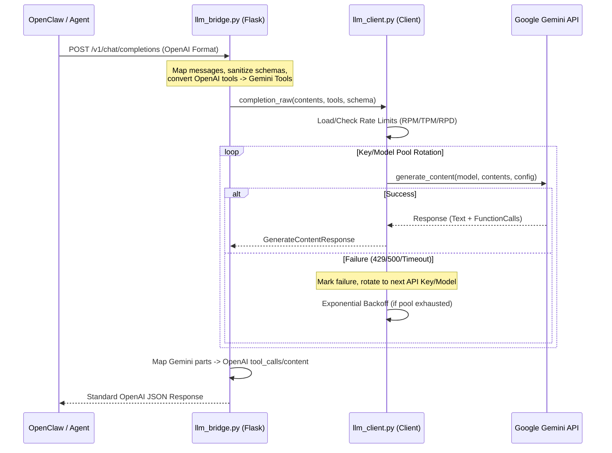

# GemmaClaw Bridge

An ultra-lightweight, OpenAI-compatible HTTP bridge that allows any agent framework (like OpenClaw or PicoClaw) to use **free Google Gemini inference** with native tool-calling and streaming support.


## Architecture & Request Flow

The bridge acts as a transparent proxy that translates OpenAI-standard requests into Google Gemini native operations.

### High-Level Sequence Diagram



---

## Key Design Principles

### 1. Request Lifecycle
1. **Reception:** The Flask bridge (`llm_bridge.py`) receives an OpenAI-compatible request.
2. **Translation:** 
   - **Messages:** Roles (`user`, `assistant`, `system`, `tool`) are mapped to Gemini's `Content` objects.
   - **Tools:** OpenAI tool definitions are sanitized (removing unsupported JSON Schema keys) and converted to native Gemini `FunctionDeclaration` objects.
3. **Execution:** The request is passed to the `RateLimitedLLMClient`.
4. **Finalization:** The Gemini response is parsed for `function_call` parts or raw text and re-packaged into the standard OpenAI response format.

### 2. Resiliency & Fallbacks
- **API Key Rotation:** The client maintains a pool of all `GOOGLE_API_KEYS` combined with all configured `LLM_MODELS`. If one combination fails (429 Rate Limit or 500 Server Error), it immediately tries the next.
- **Exponential Backoff:** If the entire pool of key/model combinations is exhausted, the client waits for `LLM_RETRY_DELAY_SECONDS` before retrying the entire pool again.
- **Wait-on-Limit:** For deterministic rate limits (RPM/TPM), the client will sleep until the next minute starts rather than returning an error.

### 3. State Management
- Usage tokens (RPM, TPM, RPD) are tracked globally.
- State is persisted to a local `.llm_requests` file on every shutdown (`atexit`), ensuring rate limits are respected across restarts.

---

## Features
- **OpenAI Compatible:** Drop-in replacement for OpenAI endpoints.
- **Native Tool Calling:** Uses Gemini's native tool-calling engine for higher accuracy than prompt-injection.
- **Streaming (SSE):** Robust Server-Sent Events implementation for real-time output without TUI flickering.
- **Schema Sanitization:** Automatically fixes tool definitions to comply with Gemini's stricter JSON Schema requirements.
- **Timeouts:** Configured with 180s timeouts to handle long-running generation tasks.

---

## 1. Setup

### Get your Gemini API Key
1. Go to [Google AI Studio](https://aistudio.google.com/app/apikey).
2. Sign in with your Google account and click **Create API Key**.

### Install
```bash
git clone https://github.com/rachancheet/GemmaClaw-bridge
cd GemmaClaw-Bridge
pip install -r requirements.txt
```

### Configure
Create a `.env` file:
```env
LLM_MODELS=gemma-4-31b-it,gemma-4-26b-a4b-it
GOOGLE_API_KEYS=key1,key2
LLM_REQUESTS_PER_MINUTE=15
LLM_TOKENS_PER_MINUTE=1000000
LLM_REQUESTS_PER_DAY=1500
LLM_MAX_CONSECUTIVE_FAILURES=5
LLM_RETRY_DELAY_SECONDS=80
```

## 2. Running the Bridge
```bash
python llm_bridge.py
```
Listens on `http://0.0.0.0:5099`.

## 3. Connecting Your Agent
Update your agent's configuration:
- **API Base URL:** `http://localhost:5099/v1`
- **Model:** `llm-client-bridge`
- **API Key:** `sk-any`
